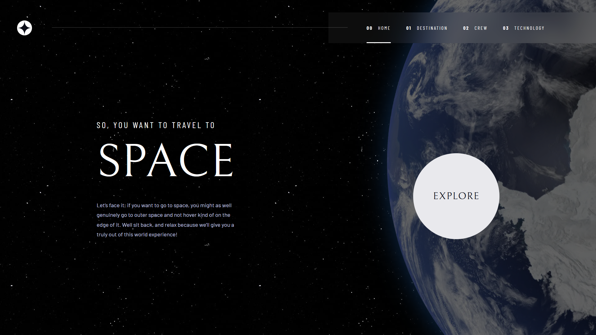

# Space Tourism

A single-page website that contains information about space, planets and modern space technologies.

You can visit website by clicking [this link](https://kanae367.github.io/space-tourism/)

## Technologies used

- HTML5
- CSS3
- Flex
- Adaptive layouts
- JS
- JQuery

## How to start

Clone the repository using the following command:

`git clone https://github.com/kanae367/space-tourism`
